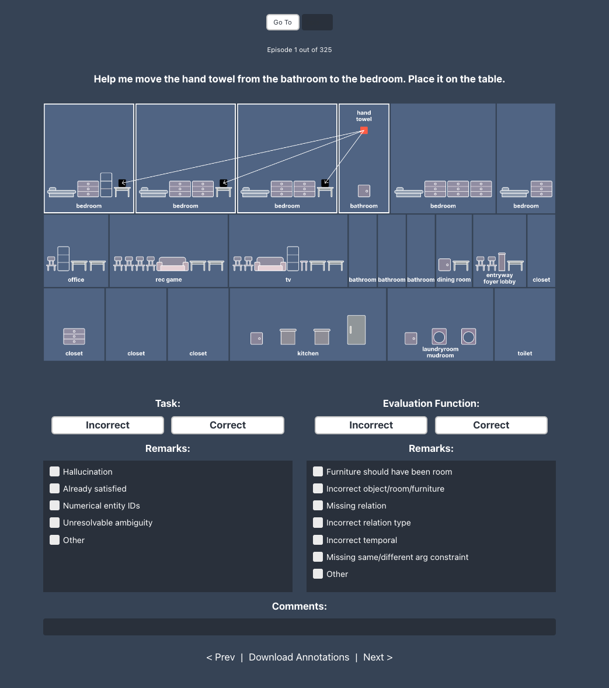
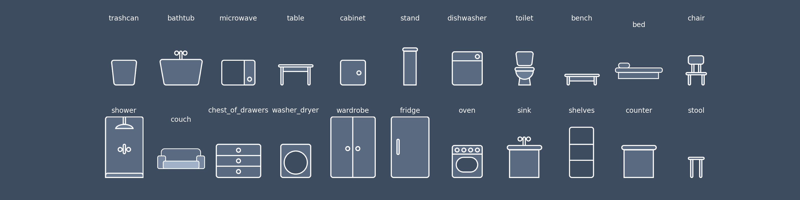

# Annotation Tool



## Structure

The sample directory is arranged as follows:

```
.
├── assets
│   ├── viz_0.png
│   ├── viz_1.png
│   ├── viz_10.png
│   .
│   .
│   .
├── interface.html
└── sample_episodes.json
```

- The assets contain the visualizations for the sample of episodes. Note that the number in `viz_<>.png` represents the list index in `sample_episodes.json`.
- The `sample_episodes.json` contains the LLM generated propositions and constraints which were used to create the visualization.
- The `interface.html` is the HTML interface for annotation. It picks up the images one by one in order, and displays it.

## Instructions
- In order to run the annotation tool, open `interface.html` on a browser of your choice. The current version has been tested on Google Chrome.
- The `Go To` button helps you get to a particular episode in the list of episodes provided. Enter the episode index (1-indexed) in the input box beside the `Go To` button, and click on `Go To` button. This is useful in case you save the annotations, and then start the interface again.
- We want to evaluate on both `Task` and `Evaluation Function` correctness. Sometimes, the task may be incorrect (e.g. it assumes a room that does not exist in the scene). Other times, the evaluation function may be incorrect (e.g. maps to incorrect receptacle or uses incorrect relation). Click on `Correct` or `Incorrect` for each based on your understanding. Please make sure you select the buttons for both `Task` and `Evaluation Function`.
- If both Task and Evaluation Function are correct, you can skip the remarks and the comments. Otherwise, you should provide some feedback as to why they are wrong.
- For both Task and Evaluation Function, we provide some pre-defined remarks. You can select one or more of these from the list. Here are examples of each:

    **Instruction/Task**:
    - Hallucination
        - The instruction references an object/furniture/room (or a relation thereof) that doesn't actually exist in the scene.
        - Example: _"Move the bowl from the cabinet to the table in the kitchen."_ The kitchen does not have a table (entity hallucination). There is a bowl in the scene, but not in a cabinet (relation hallucination).
    - Already satisfied
        - The task asks to move some object to a room where it is already initialized.
        - Example: _"Move the bowl and pitcher to the cabinet"_. If either the bowl or pitcher was initialized in the cabinet, then the task is already satisfied.
    - Numerical entity IDs
        - The instruction is unclear without knowing the instance IDs of objects, furniture or rooms.
        - Example: _"Take the t-shirt from bedroom 1 to the bed in bedroom 2."_ The viz tool may display this as _"Take the t-shirt from bedroom to the bed in bedroom"_, either should be marked wrong.
    - Unresolvable ambiguity
        - The task is unclear and requires additional context or preferences.
        - Eample: _"Let's tidy up the living room."_
    - Other

    **Evaluation Function**:
    - Furniture should have been room
        - Evaluation uses furniture for a placement, but the instruction specifies anywhere in a room.
        - Example: _"Move the doll to the playroom."_ and the eval requires the doll to be placed on particular furniture in the playroom.
    - Incorrect object/room/furniture
        - Evaluation maps to incorrect room/furniture or moves the wrong object.
        - Example: _"Move the doll to the playroom."_ and the eval requires the doll to be in a bedroom.
    - Missing relation
        - The evaluation function misses one or more rearrangements in the instruction. This includes `on the floor` underline and/or missing one or more objects which were to be rearranged.
    - Incorrect relation type
        - Evaluation function maps to the correct furniture, but uses the wrong relation.
        - Example: _"Set the doll on the cabinet."_ but the eval requires the doll to be inside the cabinet.
    - Incorrect temporal
        - The evaluation function misses, over-specifies, or otherwise requires the wrong temporal order. A temporal instruction requires some relations to be satisfied before others (first do X, then do Y).
    - Missing/incorrect same/different arg constraint
        - The task requires the two objects to be placed on same furniture (_"Place the candles on a table in the living room"_), or strictly different furniture (_"Place a candle on each table in the living room"_), but the evaluation function does not specify that.
        - **Note that** all such tasks will have by default incorrect evaluation functions, as we do not support same arg/different arg constraints currently.
    - Other
- In case you select `Other` for either Task or Evaluation Function, please add a comment in the `Comments` input as to why you feel either `Task` or `Evaluation Function` is incorrect. For other remarks, adding `Comments` is optional but encouraged.
- If the task is incorrect, you may skip the correctness/incorrectness for the evaluation function.
- In cases where objects which are to be placed on the floor, you will see an underline on the object.
- In cases where only one out of many objects are to be moved, you will see a dotted arrow for all objects.
- Use `Prev` and `Next` buttons to navigate to next or previous episodes.
- Once you are done for the current session, please click on `Download Annotations`.
- The current state is saved when you click `Prev` or `Next` or `Download Annotations`. You should see your current annotations when you navigate to an already annotated episode.
- It is okay to maintain several JSON files as long as you ensure there are no overlaps between the episodes, as we will combine these JSON files later on.


## Caveats
- The current interface does not support loading the saved annotations. 
- If you close the browser window or refresh it, the saved data will be lost. Ensure to `Download Annotations` before closing or refreshing.
- If you intend to take a break (exiting the window, switching off your laptop), please make sure to remember to click on `Download Annotations` and save the annotations so far. Also, keep a track of the episosde number you are done evaluating in case you want to come back to it later.
- In some cases, the dotted arrow may not be clearly visible (dots may be too close), please assume it exists in such cases.

## Ambiguities/QAs

- In this case, if I see that one of the tables is not selected, even though it could be a potential receptacle, do I mark the evaluation function to be incorrect?
  - This is actually a problem case with the task. The reason that table isn't included is because the object is initialized on it. We assume objects are moving from one place to another, thus no line. So if we see cases where all but one furniture within a room are marked correctly, then let's verify this as correct eval. incorrect task. It can be tricky to spot and will be easier when we have initial states visualized.
- If the task says "Move the items" (no specific objects specified), is the task correct?
  - Yes
- What does "place near Y" mean?
  - We consider this a spatial task involving a "is_next_to" relation. Such tasks aren't supposed to be included in this batch, but aren't inherently wrong.
- What is "bedside" or "coffee" in tables? What should be the correct answer for this?
  - We don't have info to resolve instances based on such descriptions, so let's allow all furniture of that class (table) in the proper room, if provided.
- What should be done if the instruction should have room IDs (but not shown in viz as we remove them)?
  - This is a bad task.
- What does "Move to X" mean? On top or inside? Or both are okay?
  - `on_top` is alway valid in such cases, and `inside` is valid where semantically reasonable (i.e. inside a rug makes no sense).
- There are cases when instructions begin like: "Help me arrange the dining room for the dinner party", and then the instructions start specifying something completely different (moving the objects from dining room to living room, or something else). Although the latter part of the tasks are proper/correct. Are such instructions overall considered correct?
  - We can consider these correct.
- What does the "new bed" mean? I assume the object is already on one bed?
  - I would treat that equivalently to "other" bed, where the object starts on a given bed.

## Furniture List
The figure below shows all the furniture that we support at the moment and their names.

